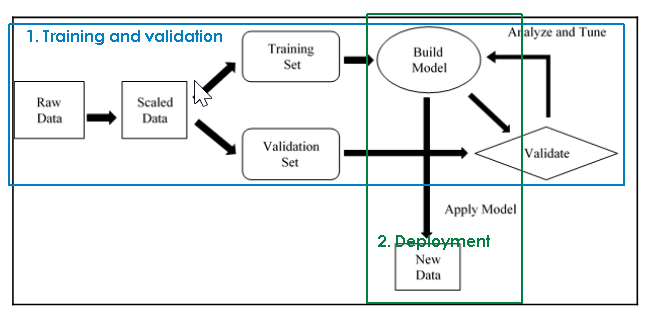
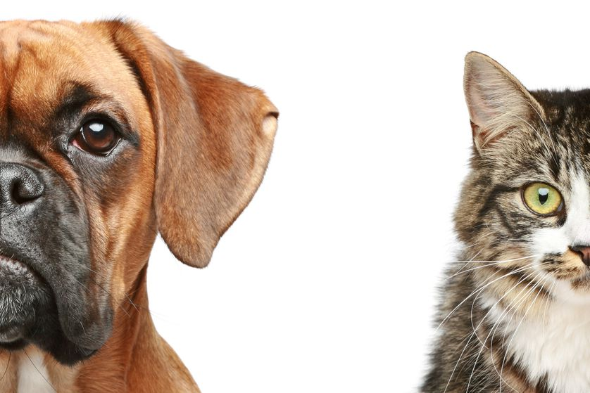
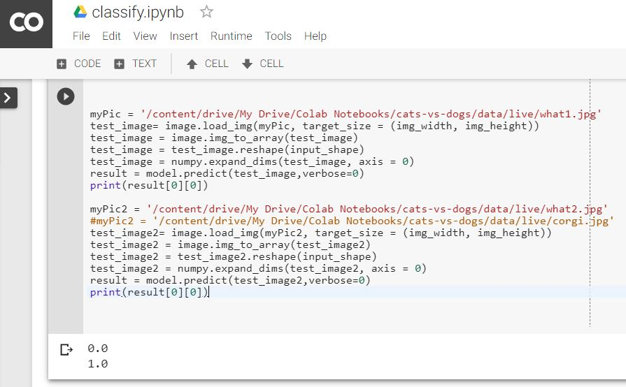

# Training a neural network to differentiate between a cat pic and dog pic

In this project, I implemented 'supervised learning' to train neural network with labeled images of cats and dogs.

Following were the steps involved in it:

This project was implemented in Colab Notebook which reads and writes files and folders in Google Drive and connects to the Google Cloud on the back-end.

- First, [training step](./train.ipynb) is carried out on 1000 cat and dog images each.

- The neural network is going to start from scratch, and learn the difference, based on these 2000 'training dataset' images.
- Then for the validation step, the network is fed 400 images each, of more cats and dogs images - these are to feed the trained network, compare its classification answers to the actual answers so as to compute the accuracy of the training
- Finally, the network is tested with new images of cats and dogs [that are not in the training or validation datasets] to [classify](./classify.ipynb) them: an output of 0 means 'cat', 1 means 'dog'.

Accuracy achieved was **82.4%** which is not that bad, for having learned from just 1000 input images for each class!
